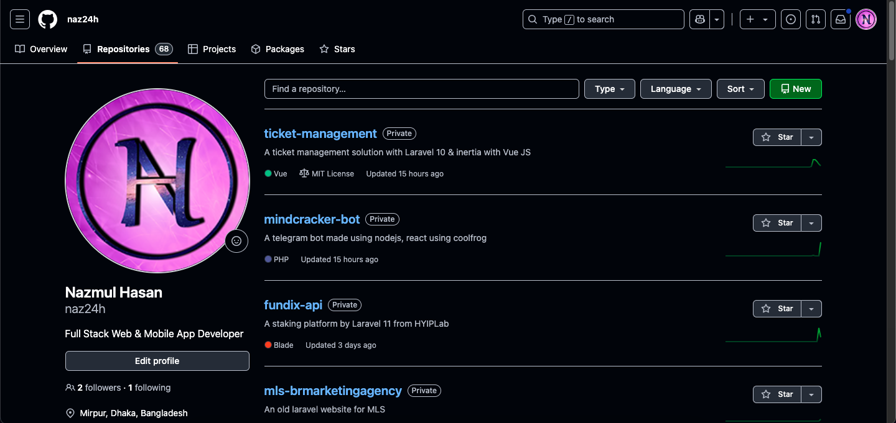
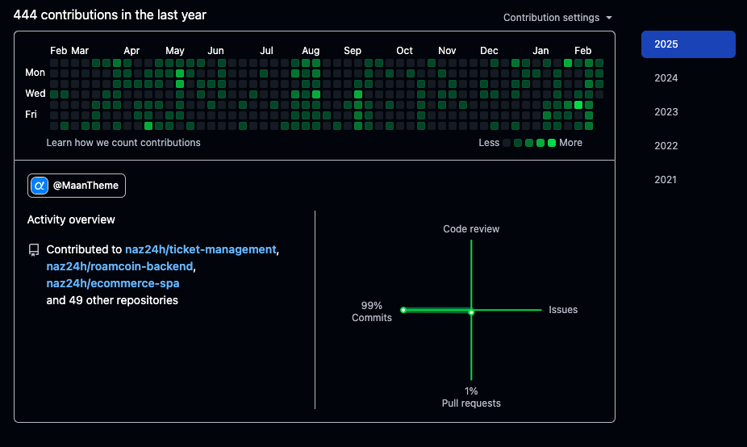

# Hi, I'm Nazmul Hasan (Tayib) 👋

I am Fullstack Web and Mobile App Developer from Bangladesh. I specialize in building a wide range of backend applications that are optimized, scale properly and as trouble-free for users. Whether it's web development on the client or server side, mobile apps or anything involving front-end and back-end I am into to deliver a great user experience.

### 🚀 Skills and Technologies:
- **Frontend:** HTML, CSS, JavaScript, React, Vue.js, Nuxt.js
- **Backend:** Laravel, PHP, Node.js, Express.js
- **Mobile Development:** Android, Flutter, Java
- **Database:** MySQL,PostgreSQL, MariaDB, SQLite, Microsoft SQL Server, MongoDB, Redis
- **DevOps:** Server Management, Docker, CI/CD
- **Tools:** Git, GitHub, VS Code, Android Studio, Postman, Xcode

### 🌱 Currently Learning:
- Advanced Cloud Computing
- Microservices Architecture
- Blockchain & Web3 Technology

### 💼 Work Experience:
I have worked on tonnes of simple to complex projects, websites and applications. My best work is achieved in collaborative environments where I can both invest myself and grow, as well as do my part to contribute the same.

### 📫 How to Reach Me:
- **Email:** naz.24h@gmail.com
- **LinkedIn:** [Nazmul Hasan](https://www.linkedin.com/in/naz24h/)
- **Website:** [Click to visit](https://nazmulhasantayib.com/)
- **GitHub:** [Nazmul Hasan](https://github.com/naz24h)

### ⚡ Fun Fact:
I love solving problems and growing my coding skills constantly. If I am not coding, you will catch me experimenting with new technologies or travelling.

Let's connect and create something amazing together!

## 📊 GitHub Stats

As most of my repositories are private, here is some information:

### 🔹 Total Repositories (Including Private)

### 🔸 Commits in the Last Year

